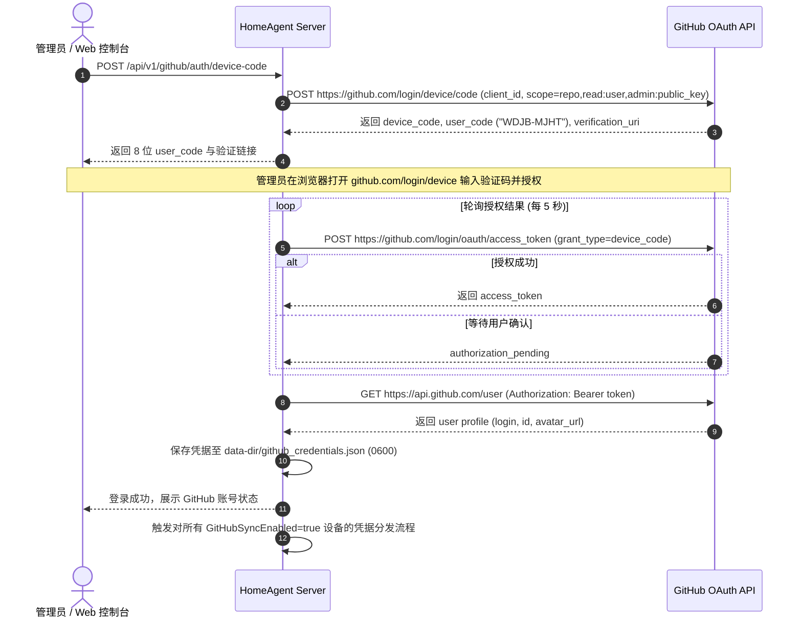
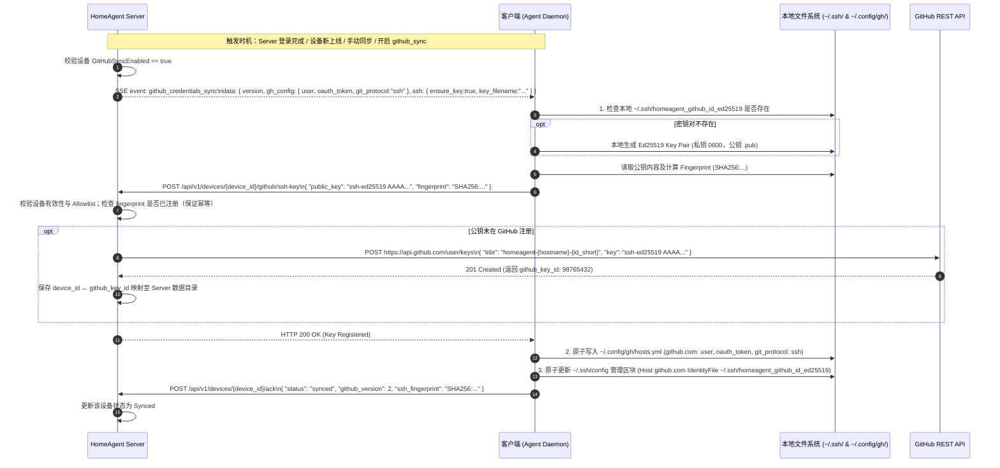

# HomeAgent GitHub 凭据同步架构方案

## 一、 总体原则与业务目标

### 1.1 核心目标
> **一次授权，全网可用**：用户仅需在 HomeAgent Server 上完成一次 GitHub OAuth 授权。此后所有被明确允许的 HomeAgent 设备都将自动获得 GitHub 的完整开发使用能力，无需在每台设备分别执行 `gh auth login`，也无需人工登录 GitHub 网页添加 SSH Key。

### 1.2 认证职责明确划分
- **Git 传输（SSH）**：负责 `git clone`、`git fetch`、`git pull`、`git push` 等源码操作。统一采用 `git_protocol: ssh`，各设备采用**本机独立生成的 Ed25519 SSH 密钥对**。
- **GitHub CLI 与 API（OAuth）**：负责 `gh` CLI（如 `gh repo`、`gh pr`、`gh issue`、`gh api`）及开发工具调用。由 HomeAgent Server 中心化管理 OAuth Token 并分发至受信任设备。

### 1.3 核心设计原则
1. **SSH Private Key 永远不离开设备**：Agent 本地生成 Ed25519 密钥对，私钥仅存本机（`0600`）；公钥上报 Server 并由 Server 通过 GitHub API 自动注册。Server 严禁生成、存储或广播任何设备 SSH 私钥。
2. **显式 Allowlist 下发策略**：采用显式 Capability 字段（`GitHubSyncEnabled: bool`，默认 `false`），杜绝基于操作系统名称或路由器特征推测下发。
3. **零特权侵入与原子更新**：Agent 严格以当前运行用户身份配置 `~/.config/gh/hosts.yml` 与 `~/.ssh/config`，采用受管标记区块（Managed Block）与临时文件原子替换（Atomic Rename），不影响用户已有配置。
4. **轻量无额外依赖**：复用现有 HomeAgent Server/Agent 架构、SSE 实时控制平面与 ACK 收敛机制，不引入 Vault、KMS 或独立 Secret 服务。

---

## 二、 整体架构与拓扑结构

```text
                             HomeAgent Server (控制中心)
                 ┌──────────────────────────────────────────────┐
                 │ - GitHub OAuth Device Flow 授权与 Token 托管 │
                 │ - 接收并托管各设备 GitHub Public Key 注册    │
                 │ - device_id ↔ github_key_id 映射与生命周期   │
                 │ - 显式 Allowlist 过滤器 (GitHubSyncEnabled)  │
                 │ - SSE 控制平面 (Event Broker) & ACK 收敛     │
                 └──────────────────────┬───────────────────────┘
                                        │
                         GitHub API ───┴─── GitHub API
                         (注册/删除 Key)   (注册/删除 Key)
                                        │
                                        │ HTTP SSE 实时控制面 & REST API
              ┌─────────────────────────┴─────────────────────────┐
              ▼ (github_sync=true)                                ▼ (github_sync=true)
       MacBook (Agent)                                     Ubuntu (Agent)
  ┌─────────────────────────────────┐                 ┌─────────────────────────────────┐
  │ 1. 本地生成 Ed25519 密钥对       │                 │ 1. 本地生成 Ed25519 密钥对       │
  │ 2. 私钥保存在本机 (0600)         │                 │ 2. 私钥保存在本机 (0600)         │
  │    ~/.ssh/homeagent_github_id...│                 │    ~/.ssh/homeagent_github_id...│
  │ 3. 上报公钥至 Server            │                 │ 3. 上报公钥至 Server            │
  │ 4. 配置 ~/.config/gh/hosts.yml  │                 │ 4. 配置 ~/.config/gh/hosts.yml  │
  │ 5. 原子配置 ~/.ssh/config        │                 │ 5. 原子配置 ~/.ssh/config        │
  └─────────────────────────────────┘                 └─────────────────────────────────┘
                                   [已跳过 (github_sync=false)]
                                     OpenWrt / NAS / Other Devices
```

---

## 三、 核心时序与生命周期设计

### 3.1 阶段一：服务端 GitHub OAuth 登录（Device Code Flow）



### 3.2 阶段二：设备密钥生成、公钥注册与凭据落地 (SSE Push & Local Configuration)



### 3.3 阶段三：细粒度 Revoke 与生命周期清理

系统明确区分 3 类撤销与清理场景：

#### 场景 1：单个设备禁用 GitHub 同步 (Device GitHub Disable)
- **触发**：管理员在控制台将某设备的 `github_sync` 从 `true` 改为 `false`。
- **执行流程**：
  1. Server 查询该设备的 `github_key_id`，调用 GitHub API `DELETE https://api.github.com/user/keys/{github_key_id}`。
  2. Server 通过 SSE 向该 Agent 发送 `github_credentials_revoke` 事件。
  3. 该 Agent 删除本地 `~/.ssh/homeagent_github_id_ed25519` 与 `.pub`，移除 `~/.ssh/config` 管理区块，清理 `~/.config/gh/hosts.yml` 中的凭据。
  4. Agent 上报 ACK (`status: revoked`)；其余设备完全不受影响。

#### 场景 2：解除 GitHub 账号绑定 (GitHub Account Disconnect)
- **触发**：管理员在 Web 控制台点击「解绑 GitHub 账号」。
- **执行流程**：
  1. Server 遍历所有已记录的 `github_key_id`，调用 GitHub API 批量删除由 HomeAgent 创建的所有设备 SSH 公钥。
  2. Server 删除 `data-dir/github_credentials.json` 及关联映射。
  3. Server 向所有在线设备广播 `github_credentials_revoke` 事件。
  4. 全网已授权 Agent 清理本地 `gh` 凭据及 GitHub SSH 配置，上报 ACK。

#### 场景 3：设备下线或注销 (Device Removal)
- **触发**：从 HomeAgent 中删除某台设备。
- **执行流程**：
  1. Server 检查该设备是否存在关联的 `github_key_id`。
  2. 若存在，自动调用 GitHub API 删除对应的 SSH Public Key，防止 GitHub 账户遗留无主废弃公钥。

---

## 四、 协议与数据结构定义

### 4.1 服务端存储结构

#### 1. GitHub 授权凭据 (`data-dir/github_credentials.json`)
存放于 Server `--data-dir/github_credentials.json`，权限严格设置为 `0600`。**严禁包含任何 SSH 私钥字段**：

```json
{
  "version": 2,
  "user": {
    "login": "exampleuser",
    "id": 12345678,
    "name": "Example User",
    "avatar_url": "https://avatars.githubusercontent.com/u/12345678"
  },
  "auth": {
    "token_type": "bearer",
    "access_token": "gho_xxxxxxxxxxxxxxxxxxxx",
    "scope": "repo,read:user,admin:public_key"
  },
  "created_at": "2026-08-20T00:00:00Z",
  "updated_at": "2026-08-20T00:00:00Z"
}
```

#### 2. 设备 SSH Key 映射记录 (`data-dir/github_device_keys.json`)
```json
{
  "devices": {
    "macbook-pro-a82f": {
      "device_id": "macbook-pro-a82f",
      "github_key_id": 98765432,
      "fingerprint": "SHA256:abcd1234efgh5678...",
      "key_title": "homeagent-macbook-pro-a82f",
      "created_at": "2026-08-20T00:05:00Z",
      "sync_status": "synced"
    }
  }
}
```

### 4.2 设备下发判定策略 (Allowlist)
Device 结构体增加显式控制字段：

```go
type Device struct {
    ID                string `json:"id"`
    Hostname          string `json:"hostname"`
    GitHubSyncEnabled bool   `json:"github_sync_enabled"` // 默认 false
    // ... 其余现有字段保持不变
}

func ShouldReceiveGitHubCredentials(d device.Device) bool {
    return d.GitHubSyncEnabled
}
```

### 4.3 SSE 控制面事件载荷

#### `github_credentials_sync` 事件
> **注意**：载荷仅包含 OAuth Token 及 SSH 指令元数据，**严禁携带 SSH 私钥**。

```json
{
  "version": 2,
  "hash": "8f83b1657ff1fc53b92dc18148a1d65dfc2d4b1fa3d677284addd200126d9070",
  "gh_config": {
    "host": "github.com",
    "user": "exampleuser",
    "oauth_token": "gho_xxxxxxxxxxxxxxxxxxxx",
    "git_protocol": "ssh"
  },
  "ssh": {
    "ensure_key": true,
    "key_filename": "homeagent_github_id_ed25519"
  }
}
```

#### `github_credentials_revoke` 事件
```json
{
  "timestamp": 1787184000,
  "reason": "sync_disabled" // 或 "account_disconnected"
}
```

### 4.4 设备端 SSH 公钥上报接口
- **端点**：`POST /api/v1/devices/{device_id}/github/ssh-key`
- **请求头**：`Authorization: Bearer <device-token>`
- **请求体**：
  ```json
  {
    "public_key": "ssh-ed25519 AAAAC3NzaC1lZDI1NTE5AAAAIGf/...",
    "fingerprint": "SHA256:7uK3j..."
  }
  ```
- **响应**：`200 OK`（包含注册状态，具备幂等性处理）。

### 4.5 ACK 状态模型
GitHub Sync 状态支持：
- `Disabled`：设备未启用 GitHub 同步；
- `Pending`：等待下发指令；
- `KeyGenerated`：Agent 本地已生成 Ed25519 密钥对；
- `KeyRegistered`：Server 已在 GitHub 完成公钥注册；
- `Synced`：`gh` 与 SSH Config 均已成功配置；
- `SyncError`：执行或注册出错；
- `Revoking` / `Revoked`：正在撤销 / 已撤销清理完毕。

ACK 上报载荷：
```json
{
  "status": "synced",
  "github_version": 2,
  "ssh_fingerprint": "SHA256:7uK3j..."
}
```
错误上报载荷：
```json
{
  "status": "sync_error",
  "stage": "github_key_register",
  "error": "github api rate limit exceeded"
}
```
> **安全红线**：ACK 载荷严禁包含 OAuth Token 或私钥数据。

---

## 五、 Agent 本地落地规范

### 5.1 GitHub CLI 凭据 (`~/.config/gh/hosts.yml`)
1. 定位当前 Agent 运行用户配置路径（Unix: `~/.config/gh/hosts.yml`；Windows: `%APPDATA%\GitHub CLI\hosts.yml`）。
2. 读取现有配置并以原子方式合并 `github.com` 条目：
   ```yaml
   github.com:
       user: exampleuser
       oauth_token: gho_xxxxxxxxxxxxxxxxxxxx
       git_protocol: ssh
   ```
3. 采用同目录临时文件（如 `.hosts.yml.tmp`）+ `os.Rename` 原子覆盖，权限设为 `0600`。

### 5.2 SSH 私钥与 Config 路由 (`~/.ssh/`)
1. **私钥生成**：
   - 路径：`~/.ssh/homeagent_github_id_ed25519`
   - 权限：严格 `0600`（目录权限 `0700`；Windows 结合 ACL 限制）。
2. **公钥存储**：
   - 路径：`~/.ssh/homeagent_github_id_ed25519.pub`
3. **`~/.ssh/config` 原子标记注入**：
   - 仅在标记区块内增删，严禁改动标记区块外部内容：
   ```sshconfig
   # BEGIN HOMEAGENT GITHUB MANAGED
   Host github.com
       HostName github.com
       User git
       IdentityFile ~/.ssh/homeagent_github_id_ed25519
       IdentitiesOnly yes
   # END HOMEAGENT GITHUB MANAGED
   ```

---

## 六、 安全规范与威胁模型 (Threat Model)

### 6.1 传输安全规范
- **强制 HTTPS/TLS 要求**：GitHub Credential 相关 API 及 SSE 控制平面通信**必须**运行在 HTTPS/TLS 加密通道上，严禁在公网以明文 HTTP 传输 OAuth Bearer Token。
- **局域网已知风险声明**：若用户在受信任局域网（Home LAN）中以 HTTP 模式运行，文档及 UI 必须明确提示：未加密的内网流量存在 Token 被局域网抓包窥探的已知风险，不得将“可信局域网”等同于 TLS 加密。

### 6.2 凭据防泄漏规范
1. **私钥隔离**：SSH 私钥永远仅在 Agent 宿主机生成与存储，不经过网络传输，不进入 Server。
2. **脱敏保护**：Server 端的 `github_credentials.json` 权限严格为 `0600`。在任何日志打印、配置导出、错误响应以及 Dashboard 前端 API Response 中，OAuth Token 必须全量脱敏（如仅展示 `gho_****xxxx`）或完全忽略。
3. **安全边界**：V1 阶段依赖主机 OS 文件权限保护 Server 端的 OAuth Token，不引入外部 Vault/KMS。若 Server 宿主机被 root 特权攻破，则 OAuth Token 存在泄漏风险，这是当前版本明确接受的安全边界。

---

## 七、 模块职责矩阵

| 角色 | 核心职责 |
| :--- | :--- |
| **HomeAgent Server** | 1. 处理 GitHub OAuth Device Flow 授权与 Token 保存；<br>2. 托管 GitHub API 交互（调用 `/user/keys` 注册/删除 SSH 公钥）；<br>3. 维护 `device_id ↔ github_key_id` 映射；<br>4. 根据 `GitHubSyncEnabled` 过滤目标设备并下发 SSE 凭据事件；<br>5. 追踪全网设备 GitHub 同步状态与 ACK 闭环。 |
| **HomeAgent Agent** | 1. 自动在本机生成 Ed25519 密钥对并妥善保管私钥（`0600`）；<br>2. 读取并向 Server 上报 SSH 公钥与 Fingerprint；<br>3. 原子配置运行用户的 `~/.config/gh/hosts.yml`；<br>4. 原子更新 `~/.ssh/config` 受管区块；<br>5. 回传 ACK 状态；响应 Revoke 事件进行本地清理。 |
| **GitHub 平台** | 1. 托管 OAuth App 授权与 Access Token；<br>2. 维护各设备注册的独立 SSH Public Key（`homeagent-{hostname}-{id_short}`）。 |
