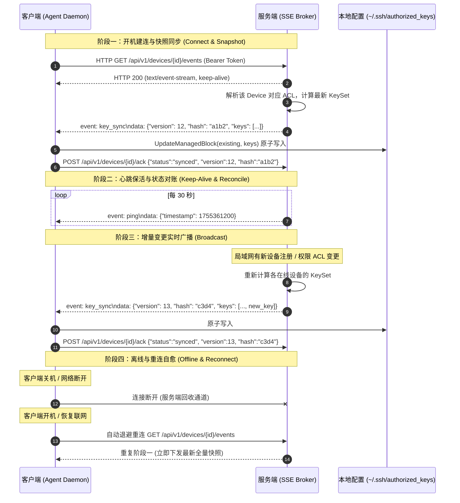
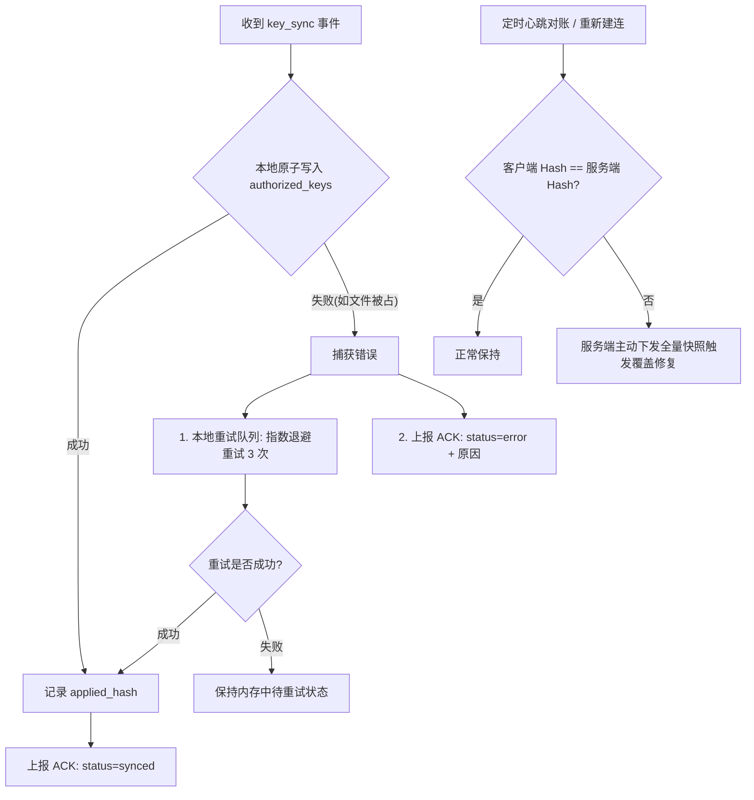

# HomeAgent 基于 SSE 与守护进程的控制平面架构方案

## 一、 背景与演进目标

### 1.1 现有架构现状与痛点
当前 HomeAgent MVP 采用 **服务端主动 SSH 登录客户端（SSH Push 模式）** 进行公钥分发：
1. **离线设备无法感知**：旧设备若在公钥同步时处于关机/离线状态，开机后无法自动补齐新公钥，必须依赖管理员手动触发或等待下次全局同步。
2. **网络直连依赖**：服务端必须能直接访问各客户端的 SSH 端口（22），无法适应复杂子网、NAT 后或防火墙拦截环境。
3. **特权凭据管理**：服务端需要持有特权私钥（`admin_ed25519`）并记录所有客户端的主机指纹（`known_hosts`）。

### 1.2 演进目标
构建基于 **HTTP SSE (Server-Sent Events) 与轻量守护进程（Daemon）** 的控制平面：
- **零人工干预（Zero-Touch）**：新设备仅需执行单行安装命令，自动完成注册、开机自启托管、首发全量同步，后续全程免维护。
- **开机即时补齐**：设备开机连入服务端的瞬间，自动收到最新全量公钥快照（Snapshot）。
- **实时变更广播**：网络内任何设备增删或 ACL 变动，在线设备毫秒级响应并更新。
- **自愈与状态闭环**：通过本地重试、状态 ACK 回传、版本号/Hash 心跳对账，确保最终一致性。
- **多业务通用底座**：同一套长连接与分发体系原生支持 SSH 公钥、GitHub 密钥、Dotfiles 配置文件、开发环境变量及远程工具管理。

---

## 二、 整体架构与时序设计

### 2.1 拓扑结构

```text
                           Mac mini (Server)
                 ┌──────────────────────────────────┐
                 │        homeagent-server          │
                 │ ┌──────────────────────────────┐ │
                 │ │ SSE Event Broker (Hub)       │ │
                 │ │ - 连接管理器 (Connection Map)│ │
                 │ │ - 状态对账器 (Reconciler)    │ │
                 │ │ - ACL 策略计算引擎           │ │
                 │ └──────────────┬───────────────┘ │
                 └────────────────┼─────────────────┘
                                  │ HTTP SSE (GET /api/v1/devices/{id}/events)
            ┌─────────────────────┼─────────────────────┐
            ▼                     ▼                     ▼
     MacBook (Agent)       Ubuntu (Agent)        Windows (Agent)
  ┌──────────────────┐  ┌──────────────────┐  ┌──────────────────┐
  │ homeagent-agent  │  │ homeagent-agent  │  │ homeagent-agent  │
  │  (Daemon 服务)   │  │  (Daemon 服务)   │  │  (Daemon 服务)   │
  │ ┌──────────────┐ │  │ ┌──────────────┐ │  │ ┌──────────────┐ │
  │ │  Dispatcher  │ │  │ │  Dispatcher  │ │  │ │  Dispatcher  │ │
  │ └──────┬───────┘ │  │ └──────┬───────┘ │  │ └──────┬───────┘ │
  │        ▼         │  │        ▼         │  │        ▼         │
  │  SSH / File /    │  │  SSH / File /    │  │  SSH / File /    │
  │  Git Handlers    │  │  Git Handlers    │  │  Git Handlers    │
  └──────────────────┘  └──────────────────┘  └──────────────────┘
```

### 2.2 核心时序交互



---

## 三、 协议与接口规范

### 3.1 SSE 订阅接口
- **端点**：`GET /api/v1/devices/{id}/events`
- **请求头**：`Authorization: Bearer <join-or-device-token>`
- **响应头**：
  ```http
  HTTP/1.1 200 OK
  Content-Type: text/event-stream
  Cache-Control: no-cache
  Connection: keep-alive
  X-Accel-Buffering: no
  ```

### 3.2 SSE 事件定义

#### (1) 公钥同步事件（`event: key_sync`）
```text
event: key_sync
data: {
  "version": 12,
  "hash": "e3b0c44298fc1c149afbf4c8996fb92427ae41e4649b934ca495991b7852b855",
  "keys": [
    {
      "device_id": "macbook-pro",
      "public_key": "ssh-ed25519 AAAAC3NzaC1lZDI1NTE5AAAAIG... user@macbook"
    },
    {
      "device_id": "ubuntu-server",
      "public_key": "ssh-ed25519 AAAAC3NzaC1lZDI1NTE5AAAAIH... user@ubuntu"
    }
  ]
}

```

#### (2) 保活心跳事件（`event: ping`）
```text
event: ping
data: {"timestamp": 1755361200}

```

### 3.3 客户端状态 ACK 接口
- **端点**：`POST /api/v1/devices/{id}/ack`
- **请求 Payload**：
  ```json
  {
    "module": "ssh_keys",
    "status": "synced",
    "applied_version": 12,
    "applied_hash": "e3b0c44298fc1c149afbf4c8996fb92427ae41e4649b934ca495991b7852b855",
    "error_message": ""
  }
  ```

---

## 四、 零接触接入与服务自启（Zero-Touch Onboarding）

### 4.1 用户接入命令（单行就绪）

#### macOS / Linux：
```bash
curl -fsSL http://<server-ip>:8080/install.sh | HOMEAGENT_SERVER="http://<server-ip>:8080" HOMEAGENT_JOIN_TOKEN="<token>" sh
```

#### Windows (PowerShell)：
```powershell
$env:HOMEAGENT_SERVER="http://<server-ip>:8080"; $env:HOMEAGENT_JOIN_TOKEN="<token>"; irm http://<server-ip>:8080/install.ps1 | iex
```

### 4.2 安装脚本执行流程
1. **下载 Agent 单二进制**：按操作系统与架构下载至系统路径（如 `/usr/local/bin/homeagent-agent`）。
2. **初始化密钥与身份**：自动生成 `~/.ssh/id_ed25519`（若不存在），获取硬件机器 ID。
3. **注册设备**：调用 `POST /api/v1/devices/register` 完成首次登记。
4. **配置开机自启守护服务**：
   - **macOS**：生成 `~/Library/LaunchAgents/com.homeagent.agent.plist` 并执行 `launchctl load`。
   - **Linux**：生成 `~/.config/systemd/user/homeagent-agent.service` 并执行 `systemctl --user enable --now`。
   - **Windows**：配置 Windows 计划任务或后台 Service。
5. **守护服务自启建连**：Agent Daemon 启动后立即建立 SSE 连接，首发拉取最新公钥并写入 `authorized_keys`。

---

## 五、 可靠性与自愈机制（Self-Healing）



1. **本地瞬态容错**：文件锁或临时 I/O 错误触发本地指数退避重试（2s, 5s, 15s）。
2. **服务端全局可观测**：通过 ACK 上报，服务端能实时感知每台机器的同步状态（`SYNCED / ERROR / PENDING`），并在 `homeagent-server devices` 中清晰展示。
3. **Hash 心跳对账与防篡改**：客户端定期上报本地 `applied_hash`；当本地文件被误删或进程异常退出时，服务端比对不一致将立即下发全量快照自动修复。
4. **主动拉取（Pull）兜底**：保留 `GET /api/v1/devices/{id}/keys` 接口，客户端在自检异常时可随时主动拉取全量基线。

---

## 六、 通用控制平面扩展模型

本方案将 Agent 设计为**模块化事件分发器（Dispatcher + Handlers）**，能够直接复用到底座的其他业务场景：

| 模块名称 | 监听事件 | 作用与下发内容 | 本地应用行为 |
| :--- | :--- | :--- | :--- |
| **SSH 公钥同步** | `event: key_sync` | 允许访问本机的对端设备公钥列表 | 原子写入 `~/.ssh/authorized_keys` |
| **GitHub / Git 凭据** | `event: git_auth_sync` | GitHub Deploy Key、PAT Token、Git 用户配置 | 写入 `~/.ssh/id_github`、配置 `~/.ssh/config` 和 `~/.gitconfig` |
| **Dotfiles 配置同步** | `event: dotfiles_sync` | 统一的配置文件映射与内容（`.zshrc`, `.tmux.conf`） | 比对文件 Hash，原子更新本地配置文件 |
| **环境变量分发** | `event: env_sync` | 局域网内共享的服务地址、API Key 环境变量模板 | 写入 `~/.homeagent/env` 供终端直接 source |
| **工具与 AI Agent 管理** | `event: tool_exec` | 软件包安装脚本、AI Agent 依赖更新指令 | 执行安装命令并将执行日志通过 ACK 回传 |

---

## 七、 实施与演进路线图

1. **第一阶段：服务端 Broker 与 SSE 接口支持**
   - 实现 `internal/broker` 事件中心（支持连接池、订阅、广播）。
   - 提供 `GET /api/v1/devices/{id}/events` 流式响应与心跳发生器。
2. **第二阶段：客户端 Daemon 常驻模式**
   - 增加 `homeagent-agent daemon` 子命令。
   - 实现 SSE 客户端事件循环与断线退避重连。
   - 实现事件分发至现有 `sshsync.UpdateManagedBlock`。
3. **第三阶段：状态 ACK 与自愈对账**
   - 实现 `POST /api/v1/devices/{id}/ack` 接口与状态记录。
   - 实现客户端版本记录与服务端 Hash 比对自愈。
4. **第四阶段：安装脚本与系统自启服务打包**
   - 升级 `install.sh` / `install.ps1`，自动注册 `launchd` / `systemd` / Windows 计划任务，实现一键零接触接入。

---

## 八、 技术选型与推荐组件组合

结合“开发效率”、“零运维负担”以及“跨平台纯粹度”，方案推荐以下技术选型与组件组合：

| 层次与能力 | 推荐方案 / 组件 | 选型理由与收益 |
| :--- | :--- | :--- |
| **SSE 推送核心（服务端 & 客户端）** | **自研（Go 标准库 `net/http`）**<br/>或 `github.com/r3labs/sse/v2` | - SSE 规范简单直观，标准库自研仅需约 100 行代码，**零外部重型依赖**。<br/>- 若使用现成库，`r3labs/sse/v2` 提供开箱即用的多通道广播与客户端自动重连。 |
| **跨平台开机自启（Daemon 托管）** | **`github.com/kardianos/service`** | - **Go 语言最主流的系统服务封装库**。<br/>- 一行代码跨平台自动适配 macOS `launchd`、Linux `systemd` 与 Windows Service，免除手写平台特定脚本的兼容痛点。 |
| **断线重连与退避算法** | **`github.com/cenkalti/backoff/v4`** | - 业界成熟的指数退避重试库，开箱即用支持加权抖动（Jitter），防止局域网断网恢复时引发重连风暴。 |
| **受管文件更新（本地原子写入）** | **复用现有 `internal/sshsync`** | - 复用现有的 `UpdateManagedBlock` 与 `atomicWrite` 机制，保障更新 `authorized_keys` 时的并发安全性。 |

### 8.1 选型收益总结
- **轻量单二进制**：无需引入 RabbitMQ、Kafka、Redis 等外部服务，服务端与客户端依然保持单一可执行文件。
- **跨平台一致性**：通过 `kardianos/service` 抹平 Mac、Linux、Windows 守护进程的安装与生命周期管理差异。
- **维护成本极低**：核心通信协议透明可控，排查网络与连接问题一目了然。

