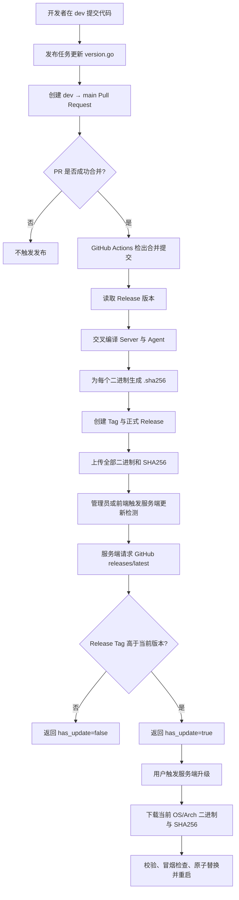

# GitHub 自动发布工作流设计

## 1. 状态

| 阶段 | 状态 | 说明 |
| --- | --- | --- |
| 设计 | 评审通过 | 用户已确认完整 Release 方案及质量门禁边界修订 |
| 实施 | 实施完成 | 已创建 GitHub Actions 工作流及对应契约测试 |
| 验收 | 本地验收完成，真实发布待执行 | 本地门禁已通过；真实 Release 与上一正式版本升级须在下次符合条件的合并后执行 |

## 2. 目标与边界

当且仅当来源分支为 `dev`、目标分支为 `main` 的 Pull Request 成功合并时，构建仓库约定的跨平台 Server 与 Agent 二进制及其 SHA256 文件，并创建一个包含全部制品的 GitHub Release。

工作流负责构建发布制品、生成 SHA256、创建 Release 并上传制品，不执行单元测试、代码质量检查、部署、安装、升级或发布后冒烟测试，也不增加版本、标签或 Release 是否已存在的前置校验。构建和上传是生成完整 Release 的必要步骤，不作为额外校验。

## 3. 触发与拒绝路径

工作流监听目标分支为 `main` 的 `pull_request.closed` 事件，并在 Job 级条件中同时要求：

- Pull Request 的 `merged` 为 `true`；
- Pull Request 的来源分支 `head.ref` 为 `dev`。

关闭但未合并的 Pull Request、其他来源分支合并到 `main`，以及直接推送到 `main` 均不得创建 Release。

## 4. Release 契约

- 使用仓库内 `internal/version/version.go` 的 `Version` 字符串作为 Release Tag；工作流只提取该值，不额外校验其格式或唯一性。
- Release 指向本次 Pull Request 的 `merge_commit_sha`。
- Release 标题与 Tag 相同。
- Release Notes 由 GitHub 自动生成。
- Release 为正式发布，不标记为草稿或预发布。
- 使用 `CGO_ENABLED=0` 交叉编译下列二进制，每个二进制生成同名 `.sha256` 文件：

| 组件 | OS | Arch | 二进制名称 |
| --- | --- | --- | --- |
| Server | Linux | amd64 | `homeagent-server-linux-amd64` |
| Server | Linux | arm64 | `homeagent-server-linux-arm64` |
| Server | Linux | arm | `homeagent-server-linux-arm` |
| Server | macOS | amd64 | `homeagent-server-darwin-amd64` |
| Server | macOS | arm64 | `homeagent-server-darwin-arm64` |
| Server | Windows | amd64 | `homeagent-server-windows-amd64.exe` |
| Server | Windows | arm64 | `homeagent-server-windows-arm64.exe` |
| Agent | Linux | amd64 | `homeagent-agent-linux-amd64` |
| Agent | Linux | arm64 | `homeagent-agent-linux-arm64` |
| Agent | Linux | arm | `homeagent-agent-linux-arm` |
| Agent | Linux | mips | `homeagent-agent-linux-mips` |
| Agent | Linux | mipsle | `homeagent-agent-linux-mipsle` |
| Agent | macOS | amd64 | `homeagent-agent-darwin-amd64` |
| Agent | macOS | arm64 | `homeagent-agent-darwin-arm64` |
| Agent | Windows | amd64 | `homeagent-agent-windows-amd64.exe` |
| Agent | Windows | arm64 | `homeagent-agent-windows-arm64.exe` |

- 编译时通过 Go `-ldflags` 将 Release 版本写入 `homeagent/internal/version.Version`，保证制品内版本与 Release Tag 一致。
- `.sha256` 内容使用常见的 `<64位小写摘要>  <文件名>` 格式，兼容现有服务端解析与安装脚本。
- `gh release create` 在一次调用中携带全部二进制与 `.sha256` 文件；任一构建、摘要生成、Release 创建或资产上传失败均令 Job 失败。
- 使用 GitHub Actions 自动提供的 `GITHUB_TOKEN`，Job 权限仅声明 `contents: write`。
- Release 创建失败时由 GitHub CLI 的退出状态直接令 Job 失败，不添加重试、覆盖或删除逻辑。

## 5. 实现范围

实施阶段新增 `.github/workflows/release.yml` 与对应契约测试，并修订既有质量门禁设计和测试中“禁止任何 GitHub Workflow”的过宽表述。工作流使用 GitHub 托管的 Ubuntu Runner、`actions/checkout`、Go 工具链与 GitHub CLI，不引入项目运行时依赖，也不修改任何现有公开接口。工作流本身不修改客户端版本号；发布前仍由对应功能任务按仓库规则更新 `internal/version/version.go`。

本次边界调整只允许经过独立设计审查的 Release Workflow，不启用托管质量门禁 CI；本地质量门禁仍以 `scripts/quality-gate.sh` 为唯一入口。

## 6. 端到端流程

服务端当前不会定时轮询 GitHub。更新检测由 `GET /api/v1/system/version-check`、带强制刷新的查询参数，或 `homeagent-server self-upgrade --check-only` 主动触发。实际升级由 `POST /api/v1/system/upgrade` 或 `homeagent-server self-upgrade` 触发。

## 7. 验收条件与证据

| 成功标准 | 验证方式 | 预期证据 |
| --- | --- | --- |
| 仅 `dev` 合并到 `main` 时创建 Release | 静态检查事件过滤器与 Job 条件 | `pull_request.closed`、`main`、`merged == true`、`head.ref == 'dev'` 同时存在 |
| Release 使用仓库版本并指向合并提交 | 静态检查版本提取、编译参数和 `gh release create` 参数 | Tag 与编译注入版本来源为 `internal/version/version.go`，目标为 `merge_commit_sha` |
| 发布资产覆盖现有安装与升级契约 | 对照资产矩阵检查构建目标和文件名 | 16 个二进制及 16 个同名 `.sha256` 均进入 Release 创建参数 |
| SHA256 可被现有消费者解析 | 使用真实构建输出运行摘要生成，并用现有解析契约读取 | 每个摘要为 64 位小写 Hex，且文件名匹配对应二进制 |
| 不执行额外检查或部署 | 检查工作流全部步骤 | 仅检出、配置 Go、读取版本、构建、生成摘要和创建完整 Release |
| 权限最小化 | 静态检查权限声明 | 仅有 `contents: write` |
| 本地质量门禁边界保持不变 | 运行质量门禁契约测试 | 不存在 `.github/workflows/quality-gate.yml`，README 仍只暴露一次本地入口 |

真实 GitHub Release 创建会写入远程状态，设计验收不触发真实发布；首次真实执行证据由下一次符合条件的 `dev → main` 合并产生。按照仓库发布门禁，正式发布后仍须从上一正式版本经真实用户入口执行服务端与适用 Agent 的升级冒烟，未通过前不得宣告发布验收完成。

## 8. 外部协议观察

- 外部服务：GitHub Releases 与 GitHub Release Assets。
- 2026-09-01 对 `v0.6.11` 的真实只读查询确认其为正式 Release，并包含 Agent 9 个平台、Server 6 个平台及各自 `.sha256` 文件。
- 对 `homeagent-server-linux-amd64.sha256` 的真实请求观察到：`github.com` 返回 `302`，跳转至 `release-assets.githubusercontent.com` 签名地址后返回 `200 application/octet-stream`，文件长度为 95 字节。
- 历史差异：`v0.6.11` 没有 `homeagent-server-linux-arm`，但现有《个人公网服务端部署方案》的正式资产矩阵要求该文件；新工作流按现有契约补齐，不以历史缺失缩减范围。
- GitHub API 匿名请求当时因公共速率额度耗尽返回 `403`；资产下载链仍成功验证。Release 资产清单通过已认证的 GitHub CLI 只读查询获得。
- 本任务不新增 fixture 或 fake server；工作流静态测试不能替代首次真实 Release 与跨版本升级验收。

## 9. 设计审查结论

- 功能边界明确：构建并创建可供 Server 与 Agent 下载升级的完整 Release，不执行部署或升级。
- 公开契约明确：Tag、制品版本、资产名称、摘要格式、目标提交和 Release Notes 均已定义。
- 状态与失败路径明确：不符合条件时跳过；任一构建、摘要、创建或上传失败时 Job 失败且不清理既有远程状态。
- 兼容性明确：不修改客户端、服务端或公开 API。
- 既有设计冲突已消解：将旧文档中的全局 Workflow 禁令修正为托管质量门禁 CI 禁令，独立 Release Workflow 由本设计约束。
- 外部依赖明确：依赖 GitHub Actions、Go 工具链、GitHub CLI 与 GitHub Releases；不新增代码依赖。
- 验收边界明确：本任务可在本地验证配置结构、触发条件和跨平台编译，但真实 Release 写入与上一正式版本升级只能在 GitHub 发布后验证。

设计审查未发现阻止实施的契约矛盾，且已获得用户明确实施授权。

## 10. 实施与本地验收记录

- 用户已明确确认实施，并授权将既有全局 Workflow 禁令修订为托管质量门禁 CI 禁令。
- 契约测试先在 `.github/workflows/release.yml` 不存在时失败，随后在实现后通过，证明测试能够阻止工作流缺失。
- 使用工作流相同的 `CGO_ENABLED=0`、目标矩阵和版本注入参数完成 16 个二进制的真实交叉编译，生成 16 个 `.sha256`，共 32 个资产；所有摘要均为 64 位小写 Hex 加文件名。
- Workflow YAML 已通过 Ruby YAML AST 解析；Release Workflow 与本地质量门禁契约测试通过。
- 变更范围检查和架构依赖检查通过。
- 全量 `go test -count=1 -race -coverprofile=... ./...` 首次在受限沙箱内因本地 TCP/UDP 端口权限失败；在受限环境外以同一命令重跑通过。
- 一次统一门禁运行被既有 `TestFullControlPlaneLifecycle` 的 `TempDir RemoveAll: directory not empty` 清理竞态阻断；未修改或跳过该测试，单独连续复跑三次均通过，随后完整统一门禁重跑通过。
- `./scripts/check-diff-coverage.sh HEAD 60 <coverage-profile>` 结果为 `100.0% (0/0 statements)`；本次新增行为位于 Workflow，未新增可计数的生产 Go 语句。
- 未创建真实 GitHub Release，未执行上一正式版本升级，因此发布验收保持待执行。
