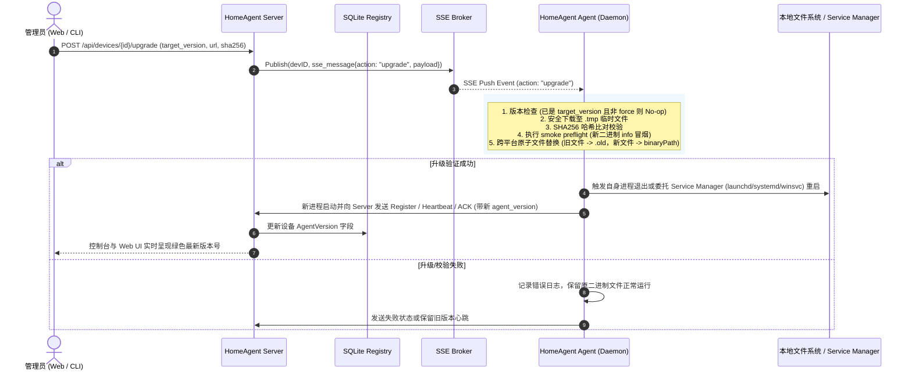

# HomeAgent 客户端带内自升级 (Agent Self-Upgrade) 方案与设计文档

## 1. 背景与目标

### 1.1 现状与痛点
HomeAgent 采用中心化控制面（`homeagent-server`）与边缘节点（`homeagent-agent`）的分布式架构，Agent 运行于 macOS（Launchd）、Linux（Systemd）及 Windows（Windows Service）等多种操作系统上。
在后续功能迭代或协议演进过程中，如果依赖人工登录每台物理机器或逐一执行安装脚本更新客户端二进制文件，运维成本高且极易因版本不一致引发协议兼容性问题。

### 1.2 目标
基于现有 SSE 实时推送控制通道（In-band Control Plane），实现 Agent **端到端安全自升级**闭环：
1. **带内即时指令下发**：Server 端支持通过 RESTful API、CLI 以及 Web 控制台触发针对单台设备或全量在线设备的自升级指令，通过 SSE 通道即时推送给 Agent。
2. **完整性与防篡改校验 (SHA256)**：Agent 端在下载新版本二进制文件后，必须执行严格的 SHA256 Hash 校验，任何哈希不匹配或损坏的文件均会被立刻丢弃并阻断升级。
3. **冒烟预检与安全门禁 (Smoke Preflight)**：原子替换前在临时目录强制执行结构化 `info` 冒烟验证，确认候选制品的组件类型、版本和 OS/Arch 与目标一致；仅执行 `--version` 不满足身份预检要求。
4. **跨平台原子替换与回滚保护**：针对 POSIX（直接重命名）与 Windows（通过临时重命名 `.old` 绕过可执行文件锁定）实现无中断原子更新；若新版本启动失败具备安全回退能力。
5. **版本回传与状态闭环**：Agent 升级重启或心跳时主动上报当前 `AgentVersion`，并在 Server 数据库与 Web 控制台中实时展示。

---

## 2. 核心架构与交互时序



---

## 3. 详细模块设计与实现规范

### 3.1 版本定义模块 ([`internal/version/version.go`](../internal/version/version.go))
- 定义全局版本常量 `Version = "v0.1.0"`（支持通过编译期 `-ldflags "-X homeagent/internal/version.Version=..."` 注入）。
- Agent 与 Server 共享该标准版本定义。

### 3.2 数据模型与注册中心扩展
- **[`internal/device/device.go`](../internal/device/device.go)**：在 `Device` 结构中新增 `AgentVersion` 字段。
- **[`internal/registry/registry.go`](../internal/registry/registry.go)**：保存设备注册信息或心跳时同步更新 `AgentVersion`，确保重启后版本持久化。

### 3.3 客户端升级引擎 ([`internal/daemon/selfupgrade.go`](../internal/daemon/selfupgrade.go))
1. **版本判断**：若目标版本与当前版本一致且未开启 `force`，直接跳过并记录 No-op 日志。
2. **下载与防篡改**：使用 HTTP GET 拉取指定 `url`，流式写入临时文件并计算 SHA256，校验一致后赋予 `0755` 执行权限。
3. **Smoke Preflight**：调用临时二进制文件的 `info` 子命令（设置 5 秒超时），并按 Agent 的结构化输出契约解析 `agent_version`、`os` 与 `arch`。能够执行 `info` 且返回这些必填 Agent 字段，作为组件类型校验；字段缺失、JSON 无法解析、版本与目标版本不符或 OS/Arch 与当前运行平台不符时，必须在替换前安全失败并保留原二进制。
4. **跨平台原子替换**：
   - **POSIX (macOS / Linux)**：重命名旧文件为 `.old`，将新二进制重命名为目标可执行文件路径，清理旧文件。
   - **Windows**：Windows 操作系统禁止直接覆盖正在运行的 `.exe`，但允许重命名正在运行的文件。因此将当前运行中的可执行文件重命名为 `agent.exe.old`，然后将新文件重命名为 `agent.exe`。
5. **平滑重启机制**：完成替换后调用 `os.Exit(0)`，依赖系统的受管服务（macOS Launchd `KeepAlive`、Linux Systemd `Restart=always`、Windows Service Manager）自动重新拉起新版可执行文件。

### 3.4 服务端控制与 API 设计 ([`internal/api/api.go`](../internal/api/api.go))
- **接口地址**：`POST /api/devices/{id}/upgrade`
- **请求负载**：
  ```json
  {
    "version": "v1.1.0",
    "url": "http://192.168.50.10:8888/downloads/homeagent-agent-darwin-arm64",
    "sha256": "3a7b...",
    "force": false
  }
  ```
- **全量升级**：当 `{id}` 为 `all` 时，Server 会自动根据每台在线设备的 `OS` 与 `Arch` 自动推导对应的下载 URL，向所有受管客户端并发下发升级指令。

### 3.5 命令行交互支持 ([`cmd/homeagent-server/main.go`](../cmd/homeagent-server/main.go))
提供便捷的 CLI 命令：
```bash
# 升级指定设备
homeagent-server upgrade <device_id_or_name> --version v1.1.0 --url <binary_url> --sha256 <hex_hash>

# 全量在线设备批量升级
homeagent-server upgrade all --version v1.1.0
```

### 3.6 Web 控制台交互 ([`internal/ui/static/app.js`](../internal/ui/static/app.js))
- 在设备列表中增加「版本 (Version)」列，直观显示客户端当前版本号。
- 卡片操作区提供「🚀 升级 (Upgrade)」按钮，点击后弹出版本升级模态框，支持填入自定义版本号、下载地址与 SHA256 校验和。
- 点击升级后前端呈现即时反馈，等待新版本心跳确认后自动刷新在线状态与版本号。

---

## 4. 测试与验证策略

1. **单元测试矩阵**：
   - `internal/daemon/selfupgrade_test.go`：版本一致 No-op 跳过、SHA256 校验不匹配阻断拦截、模拟下载与原子替换成功全路径。
   - `internal/api/api_test.go`：升级接口权限认证、参数校验、SSE 事件分发与全量广播验证。
   - `cmd/homeagent-server/main_test.go`：服务端 CLI `upgrade` 指令解析与分发测试。
2. **冒烟与全量回归**：
   - 全模块回归测试确保旧版本功能、SSH 公钥同步、Wake-on-LAN 及 DDNS 不受影响。
3. **跨版本发布验收**：
   - 使用上一正式版本 Release Tag/Commit 源码编译的真实 Agent，通过真实用户入口执行就地升级，不以升级协议 Mock 或内部替换函数代替。
   - 候选制品替换前必须通过真实 `info` 输出校验组件类型、OS/Arch 与版本；任一身份字段与目标设备不匹配时安全失败。
   - 重启后必须由实际运行实例重新上报目标版本，方可判定升级收敛；请求目标版本、命令 ACK 或文件替换成功均不是运行版本证据。
   - 每次验收记录适用的源版本、候选版本、Release Tag/Commit、执行时间与结果；阶段性设计中的历史记录只证明其标注版本组合，不得外推为后续版本已验收。
