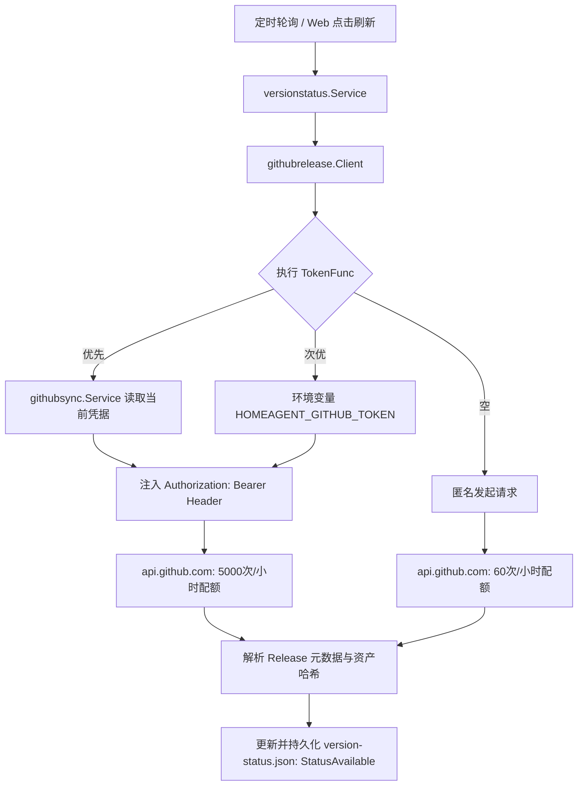

# GitHub 发布查询认证与频控优化设计方案

## 1. 文档状态

| 阶段 | 状态 | 说明 |
| :--- | :--- | :--- |
| 设计 | 已通过 | 设计审查完成，公开契约、状态流转与真实验证完备，已获实施授权 |
| 实施 | 已完成 | 核心逻辑已实现，TokenFunc 注入、多级凭据探测与降级、401/403 退避与版本升级完成 |
| 验收 | 已通过 | 单元测试、-race 全量回归与 Diff Coverage (95.8%) 门禁均 100% 通过 |

---

## 2. 背景与问题定义

### 2.1 现状与问题

1. **GitHub Releases 查询全匿名无凭据**：
   - 目前服务端在 [`internal/githubrelease/client.go`](file:///Users/roki/Projects/home-agent/internal/githubrelease/client.go#L138-L146) 中，发起 GitHub Releases 列表查询请求时未附带 `Authorization` 头部；
   - GitHub API 对匿名调用的速率限制极严（按出口 IP 限制，上限仅为 **60 次/小时**）。
2. **频控耗尽导致升级安全门禁误阻断**：
   - 只要出口 IP 达到 60 次阈值，GitHub API 就会返回 `403 Forbidden`（`x-ratelimit-remaining: 0`）；
   - [`internal/versionstatus/service.go`](file:///Users/roki/Projects/home-agent/internal/versionstatus/service.go#L107) 捕获错误后，会将本地版本快照标记为 `status: "stale"`；
   - 当用户在前端控制台点击设备升级按钮时，[`internal/api/api.go:ResolveUpgradePayload`](file:///Users/roki/Projects/home-agent/internal/api/api.go#L1038) 校验快照状态发现非 `available`，直接抛出 `agent release snapshot is not available` 错误，阻断了正常升级流程。
3. **已有可用高配额凭据未被复用**：
   - 系统已具备 [`githubsync.Service`](file:///Users/roki/Projects/home-agent/internal/githubsync/service.go#L43) 模块，支持用户在 Web 页面通过 GitHub OAuth Device Flow 绑定 GitHub 账号并持久化于 `github_credentials.json`；
   - 绑定的个人访问凭据具备 **5000 次/小时** 的充裕配额，但未对接给 `githubrelease.Client` 消费；
   - 同时也缺乏环境变量级别的静态 Token（如 `HOMEAGENT_GITHUB_TOKEN`）配置入口。

---

## 3. 目标与非目标

### 3.1 目标

1. **支持动态与静态认证凭据注入**：
   - `githubrelease.Config` 增加动态 Token 获取回调函数 `TokenFunc func() string`，在构建请求时动态注入 `Authorization: Bearer <token>`；
   - 支持动态凭据刷新（例如用户在 Web 端重新绑定 GitHub 账号或 Token 轮转后，无需重启进程即可自动生效）。
2. **多层级凭据自动串联与平滑降级**：
   - **优先级 1（自动集成）**：从已初始化的 `githubsync.Service` 动态获取当前绑定的 Access Token；
   - **优先级 2（环境变量）**：从环境变量 `HOMEAGENT_GITHUB_TOKEN` 或 `GITHUB_TOKEN` 读取静态 Token；
   - **优先级 3（降级匿名）**：未配置任何 Token 时平滑降级至现有的匿名请求，不破坏任何现有兼容性。
3. **完善的凭据安全与日志脱敏**：
   - 请求头与错误日志中严禁打印完整 Token，日志必须遮蔽（如仅展示前缀或完全脱敏）；
   - 单元测试严禁硬编码任何真实私钥或凭据。
4. **精确的 HTTP 状态码与退避处理**：
   - 识别 401（Bad credentials / Token 已吊销），在探测到无效 Token 时回落至匿名或触发凭据失效告警，避免持续死锁；
   - 识别 403 / 429（Rate limit exceeded），保留现有的退避与快照保护逻辑。

### 3.2 非目标

- 不改变现有前端 UI 结构和交互布局（现有的系统设置 GitHub 绑定卡片与版本检查卡片保持不变）。
- 不引入新的外部强制第三方依赖库（沿用标准库 `net/http`）。

---

## 4. 架构设计与契约定义

### 4.1 核心组件与数据流



### 4.2 模块契约扩展

#### 1. `internal/githubrelease/client.go`
扩展 `Config` 结构体，新增 `TokenFunc` 扩展点：
```go
type Config struct {
    Repo            string        // 格式: "owner/repo" (例如 "RokiLai/home-agent")
    APIBase         string        // 默认为 "https://api.github.com"
    DownloadBaseURL string        // 默认为 "https://github.com"
    MirrorPrefix    string        // 可选加速镜像前缀 (如 "https://ghproxy.net/")
    CacheTTL        time.Duration // 最新 Release 缓存时长
    HTTPClient      *http.Client  // 底层 HTTP 客户端
    TokenFunc       func() string // 动态获取 GitHub Token 的回调函数（返回空则发送匿名请求）
}
```

在请求构造处应用：
```go
if c.tokenFunc != nil {
    if token := strings.TrimSpace(c.tokenFunc()); token != "" {
        req.Header.Set("Authorization", "Bearer "+token)
    }
}
```

#### 2. 服务端装配入口 `cmd/homeagent-server/main.go`
在初始化 `releaseClient` 时注入多级凭据探测器：
```go
tokenProvider := func() string {
    if ghSvc != nil {
        if creds, err := ghSvc.GetCredentials(); err == nil {
            if token := strings.TrimSpace(creds.Auth.AccessToken); token != "" {
                return token
            }
        }
    }
    if envToken := strings.TrimSpace(os.Getenv("HOMEAGENT_GITHUB_TOKEN")); envToken != "" {
        return envToken
    }
    if envToken := strings.TrimSpace(os.Getenv("GITHUB_TOKEN")); envToken != "" {
        return envToken
    }
    return ""
}

releaseClient := githubrelease.NewClient(githubrelease.Config{
    Repo:         c.githubRepo,
    MirrorPrefix: c.githubMirrorPrefix,
    TokenFunc:    tokenProvider,
})
```

CLI Flag 新增支持：
- `--github-token` / 环境变量 `HOMEAGENT_GITHUB_TOKEN`

---

## 5. 状态流转与失败路径

| 触发场景 | 凭据状态 | 外部响应 | 内部处理逻辑 | 最终版本快照状态 | 用户端现象 |
| :--- | :--- | :--- | :--- | :--- | :--- |
| 正常调用 | Token 有效 | 200 OK | 解析 Release，更新资产摘要 | `StatusAvailable` | 升级指令正常下发 |
| 未配置 Token | 无 Token | 200 OK | 匿名请求，更新资产摘要 | `StatusAvailable` | 升级指令正常下发（消耗匿名配额） |
| 未配置 Token | 无 Token | 403 Rate Limit | 匿名耗尽，触发重试退避 | `StatusStale` (<=24h) 或 `StatusError` | 提示 `rate_limited`，安全拒绝升级 |
| Token 被吊销 | Token 无效 | 401 Unauthorized | 记录凭据失效错误，降级重试 | `StatusStale` | 提示 `bad_credentials`，引导用户重新授权 |
| 网络超时/断网 | 任意 | Network Error | 触发重试退避与快照保活 | `StatusStale` | 保持已有版本信息，等待网络恢复 |

---

## 6. 兼容性与安全性设计

1. **完全向后兼容**：
   - 不依赖必填 Token。若用户未配置任何凭据，行为与现有代码完全一致；
2. **凭据零泄露原则**：
   - 错误日志中严禁输出 `Authorization` 头部或 Token 内容；
   - 单元测试与 mock 严禁引入真实 GitHub Token。

---

## 7. 验收标准与测试策略

### 7.1 单元测试（先于实现）
1. **`internal/githubrelease` 单元测试**：
   - 测试 `TokenFunc` 返回有效值时，发出的 HTTP 请求带有正确的 `Authorization: Bearer <token>` 头；
   - 测试 `TokenFunc` 为 nil 或返回空字符串时，发出的 HTTP 请求不带有 `Authorization` 头；
   - 测试 401 响应时安全处理，不发生崩溃；
   - 测试 403 响应时的错误分类。
2. **`cmd/homeagent-server` 装配测试**：
   - 验证优先读取 `githubsync.Service` 凭据；
   - 验证无 `githubsync` 凭据时 fallback 读取环境变量 `HOMEAGENT_GITHUB_TOKEN`；
   - 验证两者皆无时优雅降级。

### 7.2 质量门禁要求
- `git diff --check` 零告警；
- 全量 `-race` 回归测试 100% 通过；
- `./scripts/check-diff-coverage.sh HEAD 60` 达到 60% 以上覆盖率。

---

## 8. 外部协议与假设审计记录

### 8.1 外部服务与关键假设
1. **GitHub API (`api.github.com/repos/{owner}/{repo}/releases`)**：
   - 假设 1：未携带 Authorization 头部时按出口 IP 限制，上限为 60 次/小时，配额耗尽返回 403 Forbidden 并带 `x-ratelimit-remaining: 0`；
   - 假设 2：携带 `Authorization: Bearer <token>` 时，配额提升至 5000 次/小时；
   - 假设 3：携带无效/吊销 Token 时，GitHub API 返回 401 Unauthorized，响应体为 `{"message":"Bad credentials","documentation_url":"https://docs.github.com/rest","status":"401"}`；
   - 假设 4：Release 资产下载 URL 位于 `github.com/.../releases/download/...` 并重定向至 S3，该静态文件拉取请求严禁附加 API Bearer Token，以免引发 S3 签名冲突。

### 8.2 真实请求验证结果
- **匿名请求验证**：
  - 执行：`curl -I -s "https://api.github.com/repos/RokiLai/home-agent/releases?per_page=1"`
  - 验证结果：返回 `HTTP/2 200`，响应头 `x-ratelimit-limit: 60`、`x-ratelimit-remaining: 57`，包含完整分页 Link 头。
- **无效 Token 反例请求验证**：
  - 执行：`curl -i -s -H "Authorization: Bearer invalid_token_12345" "https://api.github.com/repos/RokiLai/home-agent/releases?per_page=1"`
  - 验证结果：返回 `HTTP/2 401 Unauthorized`，Body 明确返回 `Bad credentials`，验证了 401 失败路径。

### 8.3 测试替身差异说明
- 单元测试使用 `httptest.Server` 模拟 GitHub REST API，其路由路径、Header 校验（`Authorization`、`Accept`、`User-Agent`）与状态码行为与真实 GitHub API 严格对齐，不引入外部第三方 mock 框架。
